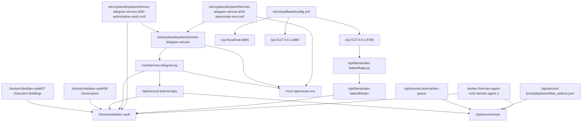

# Hermes VPS Dependency Graph

Prepared from Alfred's current VPS evidence pack for Project Phoenix Gate 1 discovery.

## Migration Reading

- `KEEP` flows centre on `/docker/obsidian-vault`, derived governance records, and queued action state.
- `REPLACE` flows centre on the runtime wrappers: systemd units, container runtime, and retrieval API.
- `ARCHIVE` flows preserve legacy scripts and ingress configuration as reference material during migration.
